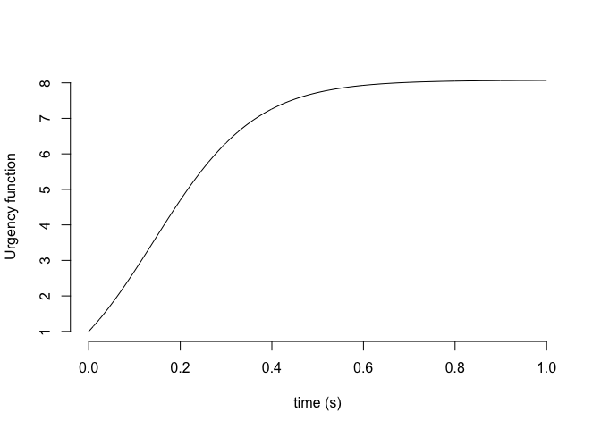
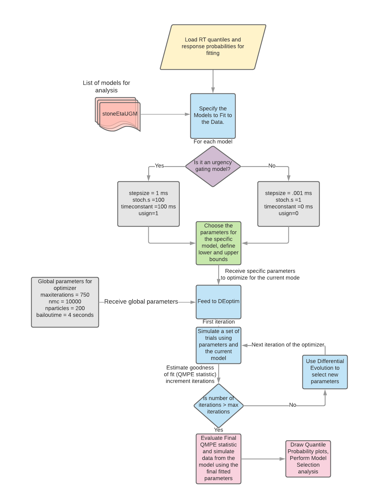

Models of Decision Making
-------------------------

There are 23 different models of decision-making that we have
implemented here. These models are not unique. Some of them are variants
of each other. For instance "stoneEtaVarTer" is the "stoneEta" model
with variability in the non decision-time.

stone, stoneEta, stoneEtaVarBase, stoneEtaVarTer, stoneEtaVarBaseVarTer, ratcliff, ratcliffVarTer models of decision-making
---------------------------------------------------------------------------------------------------------------------------

$$
\\begin{aligned}
x(t+1) = x(t) + v \\times dt + \\sqrt(dt) \\times s \\times N(0,1)
\\end{aligned}
$$
 Where *x* is the decision variable, *v* is the drift rate, *d**t* is
the step size, *s* is the standard deviation of the noise, *N*(0, 1)
denotes the normal distribution.

A correct responseis made when
*x*(*t* + 1)&gt;*a**u**p**p**e**r* and an incorrect response
when *x*(*t* + 1)&lt;*a**l**o**w**e**r*. The decision time is
identified at the first time when the process crosses the lower or the
upper bounds. The total reaction time is estimated as a sum of the
decision time and a non decision time that is also estimated from the
RTs. The non decision time is thought to reflect processes such as
stimulus encoding and motor initation time.

### stoneEta

$$
x(t+1) = x(t) + v\_{sample} \\times dt + \\sqrt(dt) \\times s \\times N(0,1)
$$

*v**s**a**m**p**l**e* ∼ *N*(*v*, *η*)
 Where *v**s**a**m**p**l**e* is drawn from each trial from a
normal distribution with mean *v* and a standard deviation *η*.

### stoneEtaVarTer

Is the same formulation as the stoneEta model except it also includes
variability in the non decision time.
$$
x(t+1) = x(t) + v\_{sample} \\times dt + \\sqrt(dt) \\times s \\times N(0,1)
$$

*v**s**a**m**p**l**e* ∼ *N*(*v*, *η*)
 The variability in the residual time for the model is defined using a
uniform distribution with a range of *s**t*0.

*T**e**r* = *u**n**i**f*(*T**e**r* − *s**t*0/2, *T**e**r* + *s**t*0/2)
 with *u**n**i**f* denoting the uniform distribution.

### stoneEtaVarBase

This model also assumes a variability in the baseline state of
accumulation. The baseline state *x*0 is again drawn from a
uniform distribution with limits of *z**m**i**n* and
*z**m**a**x*.

$$
x(t+1) = x(t) + v\_{sample} \\times dt + \\sqrt(dt) \\times s \\times N(0,1)
$$
*x*0 = *u**n**i**f*(*z**m**i**n*, *z**m**a**x*)
*v**s**a**m**p**l**e* ∼ *N*(*v*, *η*)

### stoneEtaVarBaseVarTer

This model is identical to the previous stoneEtaVarBase model except
with an introduction of a variabilityin the residual time for the model
which is again defined using a uniform distribution with a range of
*s**t*0.
$$
x(t+1) = x(t) + v\_{sample} \\times dt + \\sqrt(dt) \\times s \\times N(0,1)
$$
*v**s**a**m**p**l**e* ∼ *N*(*v*, *η*)
*x*0 = *u**n**i**f*(*z**m**i**n*, *z**m**a**x*)
*T**e**r* = *u**n**i**f*(*T**e**r* − *s**t*0/2, *T**e**r* + *s**t*0/2)

### ratcliff, ratcliffVarTer model

The ratcliff model is identical to the stoneEtaVarBase model. The
ratcliffVarTer model is identical to the stoneEtaVarBaseVarTer model.

Stone UGM model
---------------

In the Urgency "gating" model that Cisek and collaborators have
proposed, there is no integration of evidence instead the input evidence
is low pass filtered and then multiplied by an urgency term that
increases with time. Note, without a low pass filter, multiplication of
instantaneous evidence by the urgency signal would lead to excessive
noise especially in the later time points. So Cisek and collaborators
argue that the sensory evidence is low pass filtered (time constants of
either 100 or 200 ms are used). Implementation of the urgency gating
model uses the exponential smoothing average approach that can be used
for discrete smoothers.

*x*0 is the initial evidence for each choice which is also
the baseline state of the process. Again assume input drift rate is *v*
and there is additive noise which again is appropriately scaled. Then
the pair of governing equations for the UGM model are as follows. The
current evidence that is used for making a decision is a weighted sum of
past evidence with the present evidence.

$$
\\alpha =  \\frac{\\tau}{\\tau + dt} \\\\
$$

$$
E(t)  =  \\alpha\\times E(t-1) + (1-\\alpha) (v\\times dt + \\sqrt dt \\times s \\times N(0,1))
$$

For a quick intuition about the method. When alpha is zero, there is no
filtering, however when alpha is 100 ms (and dt is 1 ms), then the
previous evidence is weighted by 0.99 and the new evidence by 0.01.

The current decision variable at time t is now given as

$$ 
u(t) = (intercept + \\beta t) \\\\
$$
*x*(*t*)=*E*(*t*)×*u*(*t*)

In classical papers the intercept is set to be zero and beta to be 1.

We went a little bit crazy and designed many other variants of it.

1.  stoneUGM
2.  stoneEtaUGM
3.  stoneEtaUGMVarTer
4.  stoneEtaUGMallVar
5.  stoneEtaUGMintercept
6.  stoneEtaUGMinterceptVarTer
7.  stoneEtaUGMVarinterceptVarTer

### stoneEtaUGM

Same as the stoneUGM model except now that there is variability in the
drift rate from trial-to-trial
$$
\\alpha =  \\frac{\\tau}{\\tau + dt} \\\\
$$

$$
E(t)  =  \\alpha\\times E(t-1) + (1-\\alpha) (v\_{sample}\\times dt + \\sqrt dt \\times s \\times N(0,1))
$$
 Where *v**s**a**m**p**l**e* is drawn from a normal
distribution with mean *v* and variance *e**t**a*
*v**s**a**m**p**l**e* ∼ *N*(*v*, *η*)

### stoneEtaUGMVarTer

Assumes the same construction as stoneEtaUGM. However the residual time
is assumed to be drawn from a uniform distribution with a mean of
*T**e**r*.

*T**e**r* = *u**n**i**f*(*T**e**r* − *s**t*0/2, *T**e**r* + *s**t*0/2)

### stoneEtaUGMintercept

The original form of the urgency gating model assumed no intercept for
the urgency signal and assumed it to be zero before the stimulus
arrived. This led to quantile probability plots where error trials were
always slower than correct trials (see "demo.r" for plotting the output
of the simple "stoneUGM").

One way to fix it is to ensure that the urgency signal also includes an
intercept term, in which case one can fit this term while keeping the
time constant *τ* and the slope term *β* intact. This provides slightly
better fits to the behavior of the monkeys than a simple UGM

### stoneEtaUGMVarintercept

There is no reason to assume that the intercept is identical on a
trial-by-trial basis. This means that we can add some additional
variability to the intercept of this urgency term.

### stoneEtaUGMVarinterceptVarTer

This starts to get very crazy very quickly. If you assume variable
intercept for the urgency signal and variable residual movement time,
you can get a new family of curves.

Stone Urgency Model
-------------------

The philosophy of the stone urgency model contains elements of the
urgency gating model and the classical stone model except that there is
no low pass filtering of the input evidence. Instead, the input evidence
is multiplied by the urgency signal and then accumulated over time.

$$ 
E(t) = (v\\times dt + \\sqrt dt \\times s \\times N(0,1)) \\\\
x(t) = x(t-1) + E(t) \\times u(t)
$$
 Both the input stimulus and the noise are multiplied by the urgency
signal which can take on many forms. An elegant 3 parameter form with
two scaling factors (*s**x*, *s**y*) and a delay
(*d*) was proposed by Jochen Ditterich (2006).

The figure below shows an example of an urgency function estimated for a
monkey performing a visual checkerboard discrimination task.

*S*1(*t*)=*e**x**p*(*s**x*(*t* − *d*)); 
*S*2(*t*)=*e**x**p*(−*s**x**d*);
$$
gamma(t) = \\frac{s\_y S\_1(t)}{1+S\_1(t)} + \\frac{1 + (1-s\_y)S\_2(t)}{1+S\_2(t)}
$$
 

### Using this toolbox.

This toolbox is an attempt by us (Chand and Guy) to provide the legions
of researchers interested in various models of decision-making a simple
and easily used toolbox for analysis of RT and discrimination accuracy
behavior in decision-making tasks. The architecture of the toolbox is
very simple. The choosing of which model to run and the lower and upper
parameters and the

We assume that there is a reasonable working knowledge of R and C.

List of Available Models
------------------------

<table style="width:100%;">
<colgroup>
<col width="26%" />
<col width="22%" />
<col width="23%" />
<col width="23%" />
<col width="4%" />
</colgroup>
<thead>
<tr class="header">
<th align="right">Model</th>
<th>Description</th>
<th>Name in model list</th>
<th>Uses C Function Name</th>
<th>Involves Urgency</th>
</tr>
</thead>
<tbody>
<tr class="odd">
<td align="right">stone</td>
<td>Vanilla drift diffusion model for decision-making originally developed by stone (1960)</td>
<td>stone</td>
<td>stone</td>
<td>No</td>
</tr>
<tr class="even">
<td align="right">stoneEta</td>
<td>Drift diffusion model with variability in the drift rates. Drift rate variability is drawn from a normal distribution.</td>
<td>stoneEta</td>
<td>stoneEta</td>
<td>No</td>
</tr>
<tr class="odd">
<td align="right">stoneEtaVarTer</td>
<td>Drift Diffusion Model with variability in the drift rates and variability in the residual time that is thought to reflect sensory and motor processing delays</td>
<td>stoneEtaVarTer</td>
<td>stoneEta</td>
<td>No</td>
</tr>
<tr class="even">
<td align="right">stoneEtaVarBaseVarTer</td>
<td>Drift Diffusion Model with variability in the drift rates, variability in the baseline state before evidence comes in and variability in the residual time that is thought to reflect sensory and motor processing delays</td>
<td>stoneEtaVarBaseVarTer</td>
<td>stoneEtaVarBase</td>
<td>No</td>
</tr>
<tr class="odd">
<td align="right">ratcliff</td>
<td>Ratcliff model that involves variability in the baseline starting point and in the drift rate</td>
<td>ratcliff</td>
<td>ratcliff</td>
<td>No</td>
</tr>
<tr class="even">
<td align="right">ratcliffVarTer</td>
<td>Ratcliff model with baseline variability, drift rate and also variability in the residual time</td>
<td>ratcliff</td>
<td>ratcliff</td>
<td>No</td>
</tr>
<tr class="odd">
<td align="right">stoneEtaUrgency</td>
<td>Drift diffusion model with variability in the drift rate and an urgency term</td>
<td>stoneEtaUrgency</td>
<td>stoneEtaUrgency</td>
<td>Yes</td>
</tr>
<tr class="even">
<td align="right">stoneEtaUrgencyVarTer</td>
<td>Drift diffusion model with</td>
</tr>
</tbody>
</table>

